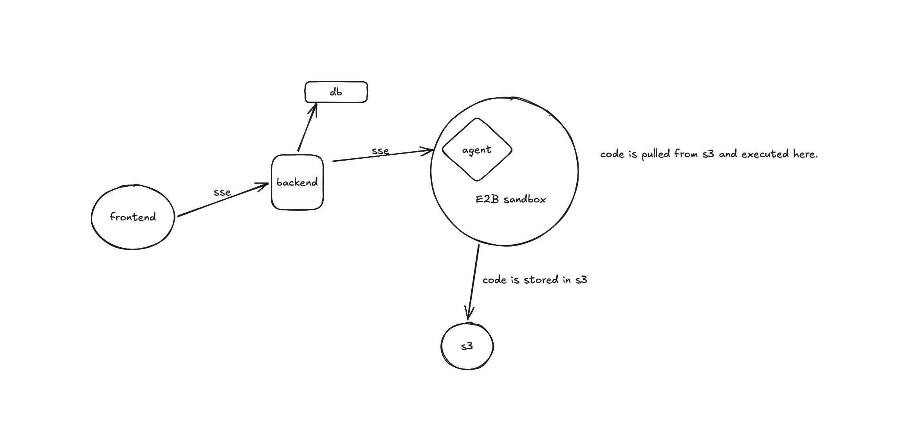

# Tyox architecture

Tyox lets users describe a React app, clarify requirements with an AI coding agent, generate code, and preview the running app.

## Current state

- React frontend streams agent updates from an Express backend using server-sent events (SSE).
- The backend and agent store project and conversation data in PostgreSQL.
- The agent has `bash`, `read_file`, `write_file`, and `QnA` tools.
- Code runs locally in `backend/projects/<project-id>`. Tasks are tied to the request and local process.
- Isolated execution, live previews, durable tasks, and S3 backups are planned, not implemented.

## Target architecture

The sketch below captures the proposed high-level design. It is a target-state diagram; the E2B sandbox and S3 integration are not implemented yet.

The frontend sends a task to the backend, which stores project and conversation data in the database and streams progress to the browser over SSE. The backend starts the agent in an E2B sandbox, where generated code can run in isolation. The sandbox saves project files to S3 for persistence; when needed, the files can be restored into a sandbox to continue work. The running React app is previewed from the sandbox, while the database remains the source of truth for chat and task state.

## Task flow

1. The backend authenticates the user, creates a durable task, and queues it.
2. A worker runs the agent in an isolated sandbox. The browser follows progress by task ID and can reconnect if disconnected.
3. For `QnA`, the task pauses in `waiting_for_user`; the user's answer queues a resume.
4. The sandbox runs the React app. The preview gateway provides the browser access to it.
5. Project snapshots are backed up to private S3 storage so a sandbox can be restored later.

PostgreSQL is the source of truth for task status and events; the queue dispatches work. S3 stores project files but does not run the preview. Sandbox code is untrusted and must have resource and network limits. The backend must enforce project access for tasks, files, and previews.

## Implementation order

1. Persist task states and events; add reconnectable progress.
2. Move agent runs to queued workers and make QnA resumable.
3. Replace local execution with isolated sandboxes and add the preview gateway.
4. Add S3 snapshots and restore.
